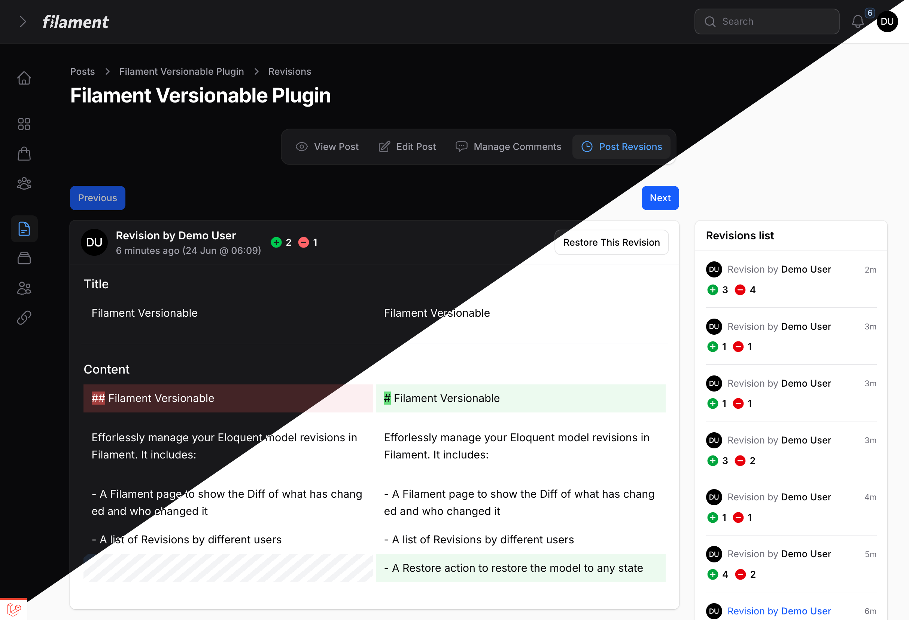

<div align="center">
    
</div>

# Filament Versionable

[](https://packagist.org/packages/mansoor/filament-versionable)
[](https://github.com/mansoorkhan96/filament-versionable/actions/workflows/run-tests.yml)
[](https://github.com/mansoorkhan96/filament-versionable/actions/workflows/fix-php-code-styling.yml)
[](https://packagist.org/packages/mansoor/filament-versionable)

Efforlessly manage your Eloquent model revisions in Filament. It includes:

- A Filament page to show the Diff of what has changed and who changed it
- A list of Revisions by different users
- A Restore action to restore the model to any state



## Installation

You can install the package via composer:

```bash
composer require mansoor/filament-versionable
```

Then, publish the config file and migrations:

```bash
php artisan vendor:publish --provider="Overtrue\LaravelVersionable\ServiceProvider"
```

Finally, run the migration:

```bash
php artisan migrate
```

## Usage

Add `Overtrue\LaravelVersionable\Versionable` trait to your model and set `$versionable` attributes.

**NOTE: Make sure to add `protected $versionStrategy = VersionStrategy::SNAPSHOT;` This would save all the $versionable attributes when any of them changed. There are different bug reports on using VersionStrategy::DIFF**

```php
use Overtrue\LaravelVersionable\VersionStrategy;

class Post extends Model
{
    use Overtrue\LaravelVersionable\Versionable;

    protected $versionable = ['title', 'content'];

    protected $versionStrategy = VersionStrategy::SNAPSHOT;
}
```

Create a Revisons Resource page to show Revisions, it should extend the `Mansoor\FilamentVersionable\RevisionsPage`. If you were to create a Revisions page for `ArticleResource`, it would look like:

```php
namespace App\Filament\Resources\ArticleResource\Pages;

use App\Filament\Resources\ArticleResource;
use Mansoor\FilamentVersionable\RevisionsPage;

class ArticleRevisions extends RevisionsPage
{
    protected static string $resource = ArticleResource::class;
}
```

Next, Add the ArticleRevisions page (that you just created) to your Resource

```php
use App\Filament\Resources\ArticleResource\Pages;

public static function getPages(): array
{
    return [
        ...
        'revisions' => Pages\ArticleRevisions::route('/{record}/revisions'),
    ];
}
```

Add `RevisionsAction` to your edit/view pages, this action would only appear when there are any versions for the model you are viewing/editing.

```php
use Mansoor\FilamentVersionable\Page\RevisionsAction;

protected function getHeaderActions(): array
{
    return [
        RevisionsAction::make(),
    ];
}
```

You can also add the `RevisionsAction` to your table.

```php
use Mansoor\FilamentVersionable\Table\RevisionsAction;

$table->actions([
    RevisionsAction::make(),
]);
```

You are all set! Your app should store the model states and you can manage them in Filament.

## Customisation

If you want to change the UI for Revisions page, you may publish the publish the views to do so.

```bash
php artisan vendor:publish --tag="filament-versionable-views"
```

If you want more control over how the versions are stored, you may read the [Laravel Versionable Docs](https://github.com/overtrue/laravel-versionable).

## Strip Tags from Diff

You can easily remove/strip HTML tags from the diff by just overriding `shouldStripTags` method inside your revisions page.

```php
class ArticleRevisions extends RevisionsPage
{
    protected static string $resource = ArticleResource::class;

    public function shouldStripTags(): bool
    {
        return true;
    }
}
```

## Testing

```bash
composer test
```

## Changelog

Please see [CHANGELOG](CHANGELOG.md) for more information on what has changed recently.

## Contributing

Please see [CONTRIBUTING](.github/CONTRIBUTING.md) for details.

## Security Vulnerabilities

Please review [our security policy](../../security/policy) on how to report security vulnerabilities.

## Credits

- [Mansoor Ahmed](https://github.com/mansoorkhan96)
- [安正超](https://github.com/overtrue) for [Laravel Versionable](https://github.com/overtrue/laravel-versionable)
- [All Contributors](../../contributors)

## License

The MIT License (MIT). Please see [License File](LICENSE.md) for more information.
